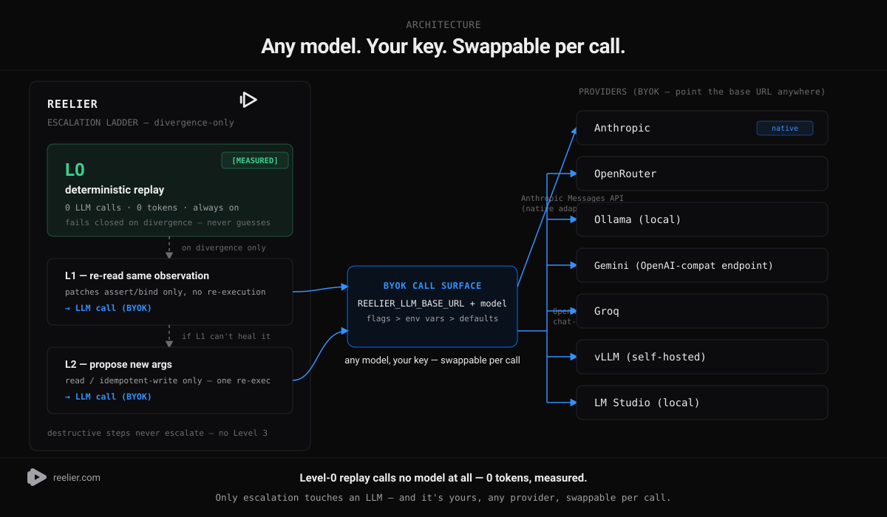

# Reelier

Your agent's muscle memory — record a workflow once, replay it
deterministically, receipt attached.

[](https://www.npmjs.com/package/@seldonframe/reelier)
[](https://github.com/seldonframe/reelier/actions/workflows/ci.yml)
[](./LICENSE)
[](./test)

Reelier records what your AI agent does once, then replays it
deterministically — 0 tokens, milliseconds, a receipt every run. For
developers whose agents do the same work over and over.

https://www.reelier.com/reelier-explainer.mp4

## Install + first receipt

```sh
npm i -g @seldonframe/reelier && reelier init
```

First receipt in 60 seconds. `reelier init` records a real workflow, compiles
it, replays it, and closes with a receipt — the actual shape (see
`src/init.ts`'s `formatReceipt`):

```
$ reelier init --yes

  1. Fetch @seldonframe/reelier's versioned npm registry metadata
  2. Fetch the package homepage, using the URL bound from the registry response
Compiled skills/reelier-init-demo-1.skill.md — 2 steps, 2 asserts, 1 bind

Open questions:
  - ...(the compiler's honest gaps, printed verbatim — never papered over)

Your receipt:
  skill:        reelier-init-demo-1
  steps:        2 total, 2 passed, 0 unchecked, 0 failed
  replay time:  44ms [measured]
  LLM tokens:   0 [measured]

  An agent doing a comparable task re-reasons every run (~2.8s, ~18k
  tokens on our benchmark); your replay: 44ms, 0 tokens.

Next steps:
  reelier run skills/reelier-init-demo-1.skill.md      # replay again
  reelier push skills/reelier-init-demo-1.skill.md     # sync receipts (opt-in)
```

`reelier init` also detects a Claude Code project MCP config (`.mcp.json`)
or user config (`~/.claude.json`) and prints the entry to add for recording
against your own MCP server(s). Without one, it runs the zero-setup demo
above. Pass `--yes` to skip every prompt and run non-interactively (no
config is ever written under `--yes`) — useful in CI.

## The measured proof

From a real, live head-to-head benchmark (agent vs. Reelier, same task,
same data) — see [`examples/benchmark`](./examples/benchmark) and
[`docs/strategy/reelier-launch/benchmark-results.md`](./docs/strategy/reelier-launch/benchmark-results.md)
for the full raw tables, methodology, and how to reproduce it yourself:

- **1,000/1,000 replays byte-identical** (N=1000 tail-variance test)
- **0 tokens per replay** (verified from the run record, not assumed)
- **~50x cheaper** ($0.000000/replay vs. $0.019068/run averaged over the agent arm)
- **~59x faster** (48ms vs. 2,842ms average latency)
- a real drift **self-healed for ~$0.001**, once, then free every replay after

## How it works

1. **Record** — `reelier mcp --wrap "<your mcp server>"` sits in front of
   your agent's real MCP tools and captures a lossless trace of what it
   actually did.
2. **Compile** — `reelier compile trace.jsonl` turns that trace into a
   `SKILL.md` deterministically, zero LLM calls — a recipe with an
   assertion on every step, and the compiler's honest gaps printed as **Open
   questions** rather than guessed at.
3. **Replay** — `reelier run skill.md` runs it again at Level 0: no LLM,
   milliseconds, byte-identical.
4. **Self-heal** — when the world drifts underneath a skill
   (`--max-level 1|2`), an LLM patches the one broken step once and writes
   its own changelog entry, so the fix never has to happen twice.

## Works with any model (BYOK)



Level-0 replay (the default) never calls a model — 0 tokens, by construction,
not convention. Escalation is opt-in and speaks through one narrow BYOK call
surface (`--llm-base-url` / `REELIER_LLM_BASE_URL` + `--llm-model`): a native
Anthropic Messages API adapter for `api.anthropic.com`, and an
OpenAI-compatible chat-completions adapter for everything else — OpenRouter,
Ollama, Gemini's OpenAI-compat endpoint, Groq, vLLM, LM Studio, or any other
host that speaks the same wire format. Better models don't obsolete Reelier —
point `--llm-base-url` at a stronger one and every skill's *next* self-heal
gets smarter for free, without recompiling anything by hand.

## Why it's not brittle RPA

- Replays **tool calls**, not pixels — nothing to break on a UI redesign.
- Every step carries its own assertion — a broken step fails loudly, never
  silently passes.
- AGPL-3.0, BYOK, local-first: the engine can never be taken closed, and
  your skills, traces, and run records are **your data**.
- Independently corroborated — [arXiv 2605.14237](https://arxiv.org/abs/2605.14237)
  found 93.3–99.98% token reduction for the same record-and-replay pattern.

The formats are specified in [SPEC.md](./SPEC.md) — a normative, RFC-style
reference (trace/SKILL.md/run-record/proxy/runner) for anyone emitting or
consuming these formats without reading this package's source.

---

## Status: v0 spike + recorder + compiler + escalation ladder (L1/L2) + init

The Level-0 deterministic runner and file formats are the spike. On top of
that there's a **recorder** (a lossless MCP proxy that captures a live agent
session as a trace), a **compiler** (`reelier compile`, turning a trace into
a runner-ready `SKILL.md` deterministically — see "Compile" below), an
**escalation ladder** (`--max-level 1|2`, see "Escalation ladder" below) —
the first LLM code in this repo, strictly opt-in — and `reelier init`, the
guided record → compile → replay → receipt loop above. There is still:

- **No Level 3** — full agentic recovery when the recorded trace no longer
  applies at all is not implemented; a diverged destructive step, or an L2
  failure, just stops the run with a message telling you to fix the skill by
  hand.
- **Zero LLM calls at the default `--max-level 0`** — by construction, not
  by convention (see below).

## Record

Point Reelier at the real MCP server(s) your agent already uses. It spawns
them, re-exposes their tools 1:1 (pure passthrough — the live path is never
modified), and adds three control tools your agent can call to capture a
lossless trace of what it did.

Install it in front of an existing MCP server (Claude Code example):

```sh
claude mcp add reelier -- npx reelier mcp --wrap "npx -y @your/mcp-server"
```

Wrap more than one downstream server by repeating `--wrap`. Then tell your
agent: **"record yourself doing this."** It will:

1. Call `reelier_start_recording {name}` — opens
   `.reelier/traces/<name>-<n>.jsonl` (`n` auto-increments so an existing
   trace is never overwritten) and returns the path.
2. Call `reelier_note {text}` before each logical step to narrate intent
   ("I'm about to pull this week's bookings"). No-op with a friendly message
   if you're not currently recording.
3. Work normally — every wrapped tool call and its result is appended to the
   trace, in order, while recording is on. Calls made while *not* recording
   pass through unlogged.
4. Call `reelier_stop_recording {}` — returns the path and how many calls
   were captured.

Then inspect it:

```sh
reelier trace .reelier/traces/<name>-1.jsonl
```

and compile it into a `SKILL.md` (see "Compile" below for what it derives
and what it leaves as open questions for you to review):

```sh
reelier compile .reelier/traces/<name>-1.jsonl
```

Once you have a skill, replay it against the same downstream(s):

```sh
reelier run skills/my-skill.skill.md --wrap "npx -y @your/mcp-server"
```

### The trace format

One JSON object per line, written in order — order in the file IS the
association between a call and its result. Every record carries a
file-global monotonic `seq`; `call`/`result` pairs additionally share a
call-index `i`.

```jsonc
{"t":"meta","seq":0,"name":"...","startedAt":"<ISO>","wrapped":["<downstream server names>"]}
{"t":"note","seq":1,"ts":"<ISO>","text":"..."}
{"t":"call","seq":2,"i":0,"ts":"<ISO>","tool":"...","args":{...}}
{"t":"result","seq":3,"i":0,"ok":true,"ms":12,"body":{...}}
```

Control-tool calls (`reelier_start_recording`/`reelier_note`/
`reelier_stop_recording`) are never themselves written as `call`/`result`
entries.

### Redaction (trace-write time only, never on the live path)

`redact()` (`src/redact.ts`) deep-walks `args`/`body` before they're written
to the trace:

- **`REELIER_REDACT`** — comma-separated env var *names*. Any occurrence of
  those vars' *values* (length ≥ 6) inside a string is replaced with
  `«redacted:NAME»`.
- **Always on, no config needed**: `sk-...`-shaped tokens and `Bearer ...`
  headers are replaced with `«redacted»`.
- **Always on**: a 32+-char hex string sitting in a field literally named
  like `/token|secret|key|password|authorization/i` is replaced with
  `«redacted»`.

This is deliberately conservative — it will miss secrets that don't match
these shapes (e.g. base64-encoded keys, secrets embedded mid-string in an
unnamed field, non-hex tokens under 32 chars). It will not corrupt a trace
with false-positive redactions of ordinary data, which was the higher
priority for a first pass. Treat trace files as sensitive until you've
verified redaction covers what you're wrapping.

### Tool name identity

A downstream tool is exposed under its original name. If two `--wrap`d
downstreams both have a tool of the same name, the later one (by `--wrap`
order, 0-indexed) is exposed as `<downstreamIndex>_<name>` and a warning is
logged to stderr. **The exposed name is what gets recorded, and it's what
`reelier run --wrap` looks up on replay** — both sides build the same
collision table from the same `--wrap` order, so a name recorded by
`reelier mcp` always resolves to the same tool on replay.

### MCP result → Observation mapping (for `reelier run --wrap`)

Runner steps assert against an `Observation` (`{status, headers, body}` —
see `src/assert.ts`). MCP tool results don't have that shape natively, so
`src/mcp-tool.ts` adapts:

- `status`: `200` if the call succeeded, `500` if the MCP result set
  `isError: true`.
- `headers`: always `{}` — MCP has no header concept.
- `body`: every `text`-type content block's `.text`, concatenated with
  `"\n"`. When a tool returns a single JSON-shaped text block (the common
  case — e.g. `{"result": 9}`), `body` *is* that JSON text, so
  `json.<dotpath>` asserts/binds parse it directly through the existing
  `JSON.parse(obs.body)` path. If a tool returns multiple text blocks, only
  `body contains`/`body match` asserts are reliable; `json.*` will fail to
  parse the concatenation — this is a documented limitation, not silently
  papered over.

Builtin `http.*` tools keep working unchanged when `--wrap` is also passed —
the MCP-backed tools are merged alongside them.

## Compile

```sh
reelier compile .reelier/traces/my-trace-1.jsonl [-o my-skill.skill.md] [--force]
```

Turns a recorded trace into a runner-ready `SKILL.md`, deterministically —
**zero LLM calls**. Default output is `<trace-meta-name>.skill.md` in the
current directory; `reelier compile` **refuses to overwrite an existing file
without `--force`** (review-before-save — it never silently clobbers a skill
you've hand-edited). On success it prints the output path, step/assert/bind
counts, an effect-class summary, and the full **Open questions** list — that
printout *is* the review step for now.

What it derives, per call in the trace (one call = one step, in call order):

- **Intent/title** from the nearest preceding `reelier_note` (consecutive
  notes join with `"; "`). No note → title `Call <tool>` and an
  auto-generated intent, plus an open question asking you to narrate it.
- **Dataflow recovery** — the core of the compiler. For every scalar arg
  value in a call (strings ≥ 4 chars, numbers whose decimal form is ≥ 4
  chars), it searches prior results' parsed JSON bodies for an exact match
  (most recent prior result wins). A hit becomes a `bind` + a
  `json.<path> is set` assert on the *source* step, and the value is replaced
  with `{{name}}` in the *consuming* step — so replay always uses the fresh
  value produced at run time, never the one baked into the trace. The same
  source path is bound once and reused by every later consumer. A match found
  inside an array element uses an index-based path (e.g. `json.items.0.id`)
  and gets an open question flagging that as drift-prone.
- **Success asserts** — a step whose recorded result was `ok` gets
  `assert: status == 200`. A step whose result was missing or not-`ok` gets
  **no assertions at all** and an open question instead.
- **Effect classes** from a verb heuristic on the tool name (read/idempotent
  write/destructive). An unrecognized verb is **conservatively downgraded to
  `destructive`** (never silently guessed safe) with an open question asking
  you to review it once.

What it deliberately leaves as **open questions**, rather than papering over:

- steps with no narration, no result, or a failed result during recording
- effect classes it couldn't confidently classify
- dataflow binds that had to use a drift-prone array index
- literal values repeated across 2+ calls that were never derived from a
  prior result — candidates for promotion to an `{{input}}` variable (a
  later, LLM-assisted step; this compiler never invents input variables
  itself)
- a trailing `reelier_note` with no call after it (a warning, not a crash)
- **(0.3.0+) date literals** — any arg string shaped like an ISO date
  (`YYYY-MM-DD`, optionally with a time suffix) gets an open question
  proposing the equivalent computed var, with the actual offset worked out
  from the trace's own recording date: `"2026-07-11"` recorded on
  `2026-07-18` becomes a suggestion to replace it with `{{today-7d}}` *if*
  that's what it means — the compiler never substitutes it for you, since
  only you know whether a recorded date was meant to be relative to run
  time or is genuinely fixed. See "Computed date template vars" below.

This is the **honest-gaps** principle: a step the compiler can't derive a
meaningful assertion for gets emitted assertion-less rather than a fabricated
check that would silently pass. The runner already reports such a step as
`unchecked`, never `passed` — the compiler's job is only to be honest about
*why*.

The compiled `SKILL.md` also seeds a `## Changelog` section (one line:
`- <date> — compiled from <tracefile> (<N> calls, <M> steps)`). That's the
write-back convention later escalation-ladder levels (L1+) will append to
when they patch a step — the changelog is the skill's own audit trail.

## The five atoms

Every step in a skill is five atoms:

| Atom | What it is |
| --- | --- |
| **intent** | A natural-language sentence describing what the step is for |
| **action** | A tool name + a JSON args template (`{{var}}` holes allowed) |
| **assert** | Predicates over the observation the tool returned |
| **bind** | Extractions from the observation that feed later steps |
| **effect** | `read` \| `idempotent-write` \| `destructive` |

## The SKILL.md format

SKILL.md-standard-compatible frontmatter, then human-editable step blocks:

```markdown
---
name: sf-post-deploy-smoke
description: Post-deploy smoke sweep of seldonframe.com core routes
---

# SF post-deploy smoke sweep

Inputs: (none for this skill; document `{{name}}` input variables here when a skill has them)

## Steps

### Step 1 — Homepage is up and branded
- intent: Confirm the marketing homepage serves and carries the brand sentinel
- action: http.get {"url": "https://www.seldonframe.com/"}
- assert: status == 200
- assert: body contains "SeldonFrame"
- effect: read
```

Steps must be numbered sequentially from 1. A malformed skill (bad
frontmatter, a missing required field, an unrecognized assert/bind
expression, an out-of-order step number) is **rejected with an error naming
the exact step and line** — Reelier never silently skips a broken step.

### Assert mini-language

- `status == <int>` / `status != <int>`
- `body contains "<text>"` / `body not contains "<text>"`
- `json.<dotpath> is array` / `is set`
- `json.<dotpath> == <json-scalar>` / `!=` / `>` / `<`
- `json.<dotpath> length > <int>` (arrays and strings)

### Bind mini-language

- `<name> = json.<dotpath>`
- `<name> = body match /<regex>/` (first capture group; no match is a
  divergence)

`today` and `today±Nd` (e.g. `today-7d`) are **reserved** — see below — and
can't be used as a bind name; `parseSkill` rejects it immediately with a
clear error rather than letting it silently shadow the computed var.

### Computed date template vars (0.3.0+)

Alongside ordinary `{{name}}` holes filled from `bind`s/`vars`, three forms
are resolved deterministically at fill time instead, never looked up in a
skill's own bindings:

- `{{today}}` — today's date, `YYYY-MM-DD`, UTC.
- `{{today-Nd}}` — the date `N` days before today (`N` an integer, `1-365`).
- `{{today+Nd}}` — the date `N` days after today.

```
- action: list_bookings {"from": "{{today-7d}}", "to": "{{today}}"}
```

That's it — no times, no other formats, no locales; a heavier need is a
future, separately-versioned form, not a silent extension of this one. A
run resolves all of these against a single clock snapshot taken once at the
start of the run, so a long-running run never straddles a UTC midnight
boundary and sees a different `{{today}}` partway through.

### Builtin tools (v0)

`http.get {url}` and `http.post {url, headers?, body?}`, backed by Node's
native `fetch` with a 15s timeout. The registry is a plain map so MCP-backed
tools can be registered alongside these later without touching the runner.

A step whose `effect` is `destructive` is refused unless `--yes` is passed —
Reelier prints the filled action instead of executing it.

## CLI usage

```sh
# The guided 60-second first run: detect config -> record (demo or real) ->
# compile -> replay -> receipt. See "Install + first receipt" above.
reelier init [--yes]

# Print every step's filled action without executing anything.
reelier run skills/my-skill.skill.md --dry-run

# Run for real. Exit 0 if every step passed or was unchecked, 1 on any failure.
reelier run skills/my-skill.skill.md

# Pass input variables.
reelier run skills/my-skill.skill.md --var name=acme

# Allow destructive steps to actually execute.
reelier run skills/my-skill.skill.md --yes

# Replay against one or more live MCP downstreams (repeatable --wrap).
reelier run skills/my-skill.skill.md --wrap "npx -y @your/mcp-server"

# Opt into the escalation ladder on divergence (default --max-level 0 —
# see "Escalation ladder" below). BYOK flags only matter when a step
# actually diverges; they're never touched at --max-level 0.
reelier run skills/my-skill.skill.md --max-level 1 \
  [--llm-base-url https://api.anthropic.com] [--llm-api-key sk-...] \
  [--llm-model claude-haiku-4-5-20251001] [--llm-l2-model claude-sonnet-5]

# Summarize a skill's run-record history (per-level step counts,
# escalation attempts vs heals, and total LLM tokens across all runs).
reelier bench skills/my-skill.skill.md

# Start the recording proxy: re-exposes each --wrap'd downstream's tools
# 1:1 plus 3 reelier_* control tools, on stdio.
reelier mcp --wrap "npx -y @your/mcp-server" [--wrap "..."] [--trace-dir <dir>]

# Pretty-print a trace file.
reelier trace .reelier/traces/my-trace-1.jsonl

# Compile a trace into a runner-ready SKILL.md (zero LLM calls). Default
# output is <trace-meta-name>.skill.md; refuses to overwrite without --force.
reelier compile .reelier/traces/my-trace-1.jsonl [-o my-skill.skill.md] [--force]

# Sync new run records (and, on first push, the skill file) to a Reelier
# Cloud instance — see "Push" below. Fully opt-in: does nothing unless both
# REELIER_CLOUD_URL and REELIER_CLOUD_KEY are set.
reelier push skills/my-skill.skill.md [--all] [--dry-run] [--with-skill]
```

Every run appends one JSON line to `.reelier/runs/<skill-name>.jsonl`. A step
with zero assertions is recorded as `"unchecked"`, never `"passed"` — an
honest-success rule: Reelier will not report a step as having verified
anything it didn't actually check.

### Run-record shape (0.2.0+)

```jsonc
{
  "skill": "my-skill",
  "startedAt": "...", "finishedAt": "...",
  // The boolean summary: true iff zero steps failed. Unchanged semantics —
  // an unchecked step still counts as "not failed".
  "passed": true,
  "steps": [
    {
      "n": 1, "title": "...",
      // 0 = ran deterministically or never healed; 1/2 = HEALED at that level.
      "level": 0,
      "outcome": "passed", // "passed" | "unchecked" | "failed" | "skipped"
      "ms": 123,
      "failures": [],
      "llm": { "inputTokens": 0, "outputTokens": 0 }, // absent if escalation never ran for this step
      // Highest escalation level TRIED for this step, present whenever
      // escalation ran at all (success OR failure) — absent if it never
      // ran. Distinct from `level`: a step can have escalationAttempted: 2
      // and level: 0 (it burned L1+L2 tokens and still never healed).
      "escalationAttempted": 1
    }
  ],
  "totals": {
    "steps": 1,
    // "passed" counts ONLY steps whose outcome is exactly "passed" — never
    // "unchecked". This is the totals-honesty fix (0.2.0): before it,
    // totals.passed silently counted "passed" OR "unchecked" together.
    "passed": 1,
    "unchecked": 0,
    "skipped": 0,
    "failed": 0,
    "ms": 123,
    "llmInputTokens": 0,
    "llmOutputTokens": 0
  }
}
```

**Records written before 0.2.0** have no `totals.unchecked`, no
`totals.skipped`, and their `totals.passed` used the old (dishonest)
"passed OR unchecked" rollup — but their per-step `outcome` values were
always recorded correctly. `reelier bench` reads a mixed history gracefully:
for any record lacking `totals.unchecked`, it derives the honest
passed/unchecked/skipped/failed split from that record's own `steps[].outcome`
instead of trusting the legacy `totals` rollup. Old records stay fully
readable; nothing needs to be migrated or re-run.

## Escalation ladder

When a step diverges (an assertion fails, a bind can't find its path), Level
0 just stops — that's still the default and it's the only thing that runs
unless you opt in. `--max-level 1|2` lets an LLM attempt a heal before the
run gives up. The whole ladder is built around one idea: **a heal that isn't
written back to the skill file is worthless**, because the same drift would
just escalate again on the very next run. So every successful heal is
persisted immediately (see "Write-back" below) — the anti-RPA-rot property:
once healed, a skill needs the LLM again only if the world drifts *again*.

### The four levels

- **L0 (default, always on)** — deterministic replay, zero LLM calls, fails
  closed on divergence. This is the only level that ever runs unless you
  pass `--max-level`.
- **L1** — re-evaluates the step's **already-captured observation** with an
  LLM-patched `assert`/`bind` set. Nothing is re-executed — L1 is zero side
  effects by construction, because it never calls a tool again, only
  re-reads the same result with fresh eyes (e.g. a JSON field moved from
  `json.id` to `json.data.id`). L1 may patch asserts and binds **only** —
  never `args`.
- **L2** — tried only if L1 didn't hold and `--max-level 2`. The LLM may
  propose patched `args` in addition to asserts/binds, and the harness
  re-executes the step **exactly once** against the new args — but **only**
  when the step's effect is `read` or `idempotent-write`. A diverged
  **destructive** step is never handed to L2 at all: it fails immediately
  with a message telling you to fix the skill by hand. That refusal *is*
  Level 3 in this version — full agentic recovery for a destructive
  divergence isn't implemented.
- **L3 (not implemented)** — full agentic recovery when the recorded trace
  no longer applies at all. Today that's a human editing the skill.

### Safety rules

- **L0 is the default and the LLM is never constructed or called at
  `--max-level 0`** — not "configured to no-op", actually never touched.
  BYOK spend is opt-in, full stop.
- **L1 never re-executes.** It only re-reads the observation the step's tool
  call already produced. There is no way for an L1 heal to cause a second
  side effect.
- **L2 never re-runs a destructive step.** The harness checks `step.effect`
  itself before ever asking the LLM for an L2 patch — an LLM proposing "just
  re-run the delete" is structurally impossible to reach for a destructive
  step in this version.
- **The LLM only ever emits a narrow JSON patch; the harness applies it.**
  Every patched `assert`/`bind` line is validated against the exact same
  grammar the skill parser uses (`src/assert.ts`) before it's allowed near
  a real observation or the skill file — an unparseable line is downgraded
  to a real failure, never silently dropped or half-applied. The model never
  writes the skill file directly.
- **Write-back is mandatory on a successful heal, not best-effort.** See
  below.

### BYOK config — "almost any LLM"

Resolved as flags > env vars > defaults:

| | Flag | Env var | Default |
| --- | --- | --- | --- |
| Base URL | `--llm-base-url` | `REELIER_LLM_BASE_URL` | `https://api.anthropic.com` |
| API key | `--llm-api-key` | `REELIER_LLM_API_KEY` (falls back to `ANTHROPIC_API_KEY` only when the base URL is `api.anthropic.com`) | *(none — required only when a step actually escalates)* |
| L1 model | `--llm-model` | `REELIER_LLM_MODEL` | `claude-haiku-4-5-20251001` |
| L2 model | `--llm-l2-model` | `REELIER_LLM_L2_MODEL` | `claude-sonnet-5` |

Two wire adapters, chosen by the base URL's host: the native **Anthropic
Messages API** for `api.anthropic.com`, and **OpenAI-compatible
chat-completions** for every other host — which is the "almost any LLM"
story: point `--llm-base-url` at OpenRouter, a local Ollama, Gemini's
OpenAI-compat endpoint, Groq, vLLM, or anything else that speaks the
chat-completions shape, and it works unchanged. The API key is only
required — and only checked — the first time a step actually escalates; a
`--max-level 1` run whose skill never diverges never needs a key.

**Observations are sent to your configured LLM during escalation.** The
prompt includes the step's text, the failure messages, and a bounded
summary of the tool's response (status, body truncated to ~2000 chars, a
truncated sample of `json.<path>` leaves) — never the full unredacted body,
but still real data from your workflow. This is BYOK: it goes to whichever
endpoint you've pointed `--llm-base-url` at, and nowhere else.

### Token accounting — honest, no cost math

Every escalation attempt's `usage` (input/output tokens) is summed into that
step's run record, **even when the escalation fails** — a step that tried L1
and L2 and still diverged still spent real tokens, and the run record says
so (`escalationAttempted` records the highest level tried regardless of
outcome). `reelier bench` prints total LLM tokens across a skill's run
history, a per-level step count (`L0=x L1=y L2=z`, the level that HEALED
each step), and a separate escalation line — attempts vs. heals per level —
so a step that burned L1 tokens and still failed is visible, not silently
absorbed into the "L0" bucket. No dollar figures are fabricated anywhere —
token counts only; pricing varies by provider and model, and this codebase
doesn't guess at it.

### Write-back and the changelog convention

A successful heal (L1 or L2) is applied to the **in-memory skill** and
immediately serialized back to the `.skill.md` file
(`src/writeback.ts`) — the patched `assert`/`bind` lines (and, for an L2
heal, the patched `args`), plus one new line under a `## Changelog` section
(created if the skill doesn't have one yet):

```
- 2026-07-17 — L1 heal, step 1 (create a note): upstream API update wrapped create_note's fields under a 'note' object (v1 -> v2)
```

`serializeSkill` (also `src/writeback.ts`) is the faithful inverse of
`parseSkill`: non-step content (the title, the `Inputs:` line, `## Open
questions`, `## Changelog`, any hand-written prose) is preserved verbatim
from the parse, and step blocks are re-rendered canonically — stable under
repeated serialize→parse→serialize even where it isn't byte-identical to
hand-formatted input.

A write-back **failure** (disk full, permission denied) is never allowed to
crash the run — the heal already worked *for this run*; only persistence
failed, and that prints a loud stderr warning instead of throwing, because
silently losing a heal means the same drift escalates again next time,
defeating the entire point of the ladder.

**(0.3.0+) Atomic write-back.** The file is never edited in place. It's
written in full to a temp file next to it (`<skill>.skill.md.tmp-<random>`)
and then renamed over the target, so a crash or kill mid-write leaves the
old, complete file behind — a torn/partial skill file is unrepresentable.
On a target that can't be renamed over directly (`EEXIST`/`EPERM`), the
fallback unlinks the target and retries the rename once. The temp file is
always cleaned up, success or failure. This guarantees safety for a single
writer; it is not inter-process locking — two reelier processes racing a
write-back against the same skill file is out of scope here and deferred to
cloud execution.

## Push

`reelier push <skill.md>` syncs a skill's local run records — and, on the
first push, the skill file itself — to a hosted Reelier Cloud instance, so
your receipts (pass rates, escalation history, LLM token spend) accrue in
one place instead of living only in `.reelier/runs/*.jsonl` on your
machine. **Fully opt-in and fully inert without config**: nothing is ever
pushed, no network call is ever made, unless both env vars below are set.

```sh
reelier push skills/my-skill.skill.md
```

### Config — two required env vars

| Env var | Meaning |
| --- | --- |
| `REELIER_CLOUD_URL` | Base URL of your Reelier Cloud instance. |
| `REELIER_CLOUD_KEY` | Your API key. |

Either missing gives a clear, actionable error naming the missing var —
**the key's value is never printed, logged, or included in any error
message.**

### What gets uploaded, and when

- **The skill file** (`skillMd`, the raw `.skill.md` source) uploads
  automatically the **first** time that skill is pushed from this working
  directory. Subsequent pushes skip it — pass `--with-skill` to force a
  re-upload (e.g. after hand-editing the skill).
- **Run records** — every line of `.reelier/runs/<skill-name>.jsonl` that
  hasn't been pushed successfully yet, in order, one `POST` per record.

### Cursor semantics

A cursor file, `.reelier/push-state.json`
(`{[skillName]: {pushed: N, skillUploaded: bool, rejected: [...]}}`),
tracks how many records (from the start of the run-record file) the
cursor has advanced past for each skill. A plain `reelier push` only
sends records *after* that cursor — running it repeatedly is cheap and
never re-sends what already made it to the cloud.

- **`--all`** ignores/resets the cursor for this run and reconsiders every
  record in the file from the start.
- **`--dry-run`** prints what *would* push (record count, cursor range)
  and touches nothing — no network call, no state file read for writing,
  no state file write.

**Two different outcomes advance the cursor differently — this is the
important part:**

- A **`400` or `413`** response is treated as the cloud's **permanent**
  verdict on that exact record (it will never fit, or it's malformed).
  These print a loud warning, get logged to a `rejected: [{index, reason,
  at}, ...]` audit array in `push-state.json` for that skill (never
  pruned automatically), and — critically — **the cursor advances past
  them and the batch keeps going.** One bad record from months ago never
  blocks everything pushed since.
- A **`401` (auth failure) or a network/other error** is treated as
  **transient** — the key or the network might work on the next attempt.
  These **stop the batch immediately** and the cursor is left at the last
  consumed record, so the very next `reelier push` retries from exactly
  there.
- **`--all` re-reports rather than deduplicating**: a previously-rejected
  record included again via `--all` that gets rejected again adds
  *another* entry to `rejected` rather than replacing the old one — it's
  a timestamped history, not overwritten state, and it never wedges: a
  record's own rejection, however many times it recurs, never blocks the
  records after it.

If `push-state.json` itself is ever corrupt (unparseable JSON — e.g. from
an interrupted write on an older version, or manual tampering), `reelier
push` doesn't hard-fail: it warns loudly, renames the corrupt file aside
to `push-state.json.corrupt-<timestamp>`, and starts fresh (worst case:
some records get re-pushed, which `--all`-shaped behavior always
recovers from cleanly). Writes to `push-state.json` are atomic
(write-temp-then-rename, the same primitive skill write-back uses).

### Per-record output

Each record's outcome prints as it happens — pushed (with the cloud's
returned id when available), permanently rejected (with the field errors
the cloud returned, or the 413 message — cursor still advances), an auth
failure, or a generic error (both of the latter two stop the batch) —
followed by a one-line summary (skill-upload status, pushed/rejected
counts, and the cursor's before/after position). The process exits
non-zero only when the batch **stopped early** on a transient outcome —
not merely because some records were permanently rejected.

### Privacy note

Run records can contain **observed values** from your actual tool calls —
status codes, response bodies (or samples of them), bind values extracted
from real observations. Pushing a run record uploads that data to whatever
`REELIER_CLOUD_URL` points at. This is why push is opt-in and explicit
(never triggered by `reelier run`, never on by default): review what a
skill's run records actually contain — the same review that applies to
trace files (see "Redaction" above) applies here, since redaction happens
at *trace*-write time, not at push time. Treat a run-record file as
potentially sensitive before pushing it anywhere.

## Licensing

The AGPL-3.0 license in this repository covers the **Reelier harness only**
— the parser, runner, and CLI in `src/`. Your traces, your `SKILL.md` files,
and your run records are **your data**. They are not covered by, and not
affected by, this license.
